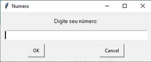
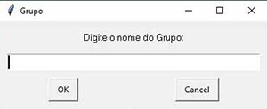

# Projeto_Admin_Whatsapp
<p align="justify">O projeto é um bot que automatizar interações no WhatsApp Web. Com ele, é possível responder automaticamente a mensagens de saudação, remover membros de grupos e saudar novos integrantes. Este projeto foi uma ótima oportunidade para aprimorar minhas habilidades em automação e integração de ferramentas. Lembrando sempre da importância de usar essa automação com responsabilidade e de acordo com as políticas de uso da plataforma.</p>

## Principais Funcionalidades:

- ✅ Responder automaticamente a saudações: O programa detecta mensagens de saudação, como 'Bom dia', 'Boa tarde' ou 'Boa noite', e envia respostas adequadas.
- ❌ Remover membros indesejados: Ele identifica membros que enviaram link no grupo e remove o mesmo, além de apagar o link enviado para todos.
- 👋 Saudar novos membros: Ao identificar novos integrantes, uma saudação de boas-vindas é enviada automaticamente.

## 🛠️ Tecnologias Utilizadas
Principal tecnologia usada:</br>
**[Selenium](https://selenium-python.readthedocs.io/)**</br>
**[Pyautogui](https://pyautogui.readthedocs.io/en/latest/)**

## Licença
Este projeto é licenciado sob a licença MIT. Consulte o arquivo [LICENSE](LICENSE) para obter detalhes.

## 🚀 Instruções de Uso

### 📋 Instalação Das Dependências
Para instalar as dependências do projeto, execute o seguinte comando:
```bash
pip install -r requirements.txt
```

### Execução do Programa:
Execute o programa a partir do arquivo principal, mas não esqueça de instalar as dependências antes.

```bash
python bot_whatsapp.py
```

#### Janela onde deve ser informado o número de telefone que será aberto o WhatsApp web:



#### Janela onde deve ser informado o nome do grupo que será administrado pelo bot:

</br>

#### Janela com informações e o código que deve ser usado para fazer a liberação do WhatsApp web no seu navegador:

</br>

#### Janela com aviso informando para esperar até que o WhatsApp web abra na sua maquina:

</br>

### Interrupção da Execução:
Para interromper a execução do programa, pressione a tecla **Espaço**.